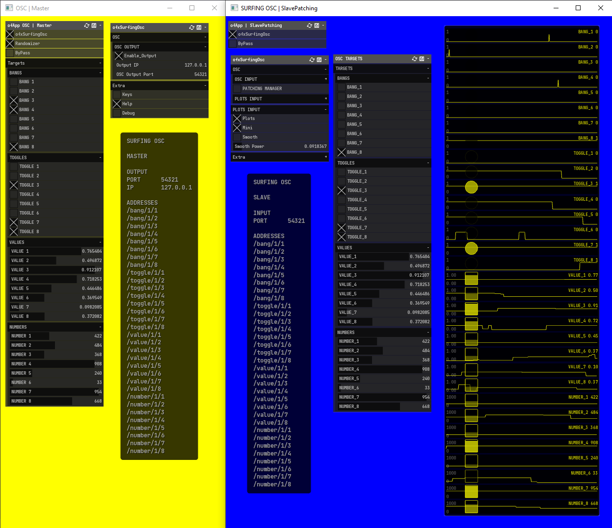

ofxSurfingOsc
=============

# Overview
**ofxSurfingOsc** is a predefined Osc Manager as a template of a combo for Master / Slave apps.

## Screenshot

## Features
- Predefined common template.
- 8 bool bangs, 8 bool toggles, 8 float values, 8 int numbers.
- Internal params with GUI.
- Persistent settings.
- Plots.

## Usage
Look Examples.

  
Dependencies

  

- ofxOsc
- ofxPubSubOsc
- ofxHistoryPlot
- ofxSurfingBox
- ofxSurfingHelpers
- ofxGui
- ofxWindowApp / Only for the example

TODO:
- ofxSurfingImGui
- ofxImGui

*Thanks a lot to all these ofxAddons coders. Look into each folder for authoring credits, original forks, and license info.*  
 

  
Tested Systems

  

  - **Windows 10** / **VS 2017** / **OF ~0.11**
  

## Author
An add-on by **@moebiusSurfing**  
*( ManuMolina ) 2019-2021*  

### Contact / Follow

<a href="mailto:moebiussurfing@gmail.com" target="_blank">Email</a> |
<a href="https://twitter.com/moebiusSurfing/" rel="nofollow">Twitter</a> | 
<a href="https://www.youtube.com/moebiusSurfing" rel="nofollow">YouTube</a> | 
<a href="https://www.instagram.com/moebiusSurfing/" rel="nofollow">Instagram</a> 

### License
MIT License