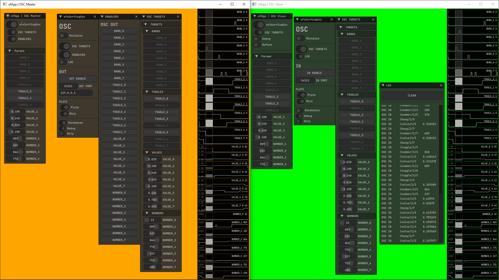

ofxSurfingOsc
=============

# Overview
An **Osc Manager** as a **predefined template** for **two linked apps**: 

**Master** to **Slave**  

Useful to easely add **Osc Out** linking **ofParams** from a **Master app**.  
And the same for the **Slave App**, linking an **Osc Input** to their **ofParams**.  

## Screenshot

## Features
- **8 Bool Bangs, 8 Bool Toggles, 8 Float Values, 8 Int Numbers**.
- Internal params with GUI.
- Persistent settings.
- Plots.
- WIP: Customized templates to disable not used channels.
  - Customize and organize channel plots.
- WIP: Patching system 
  - assign channels for different Target **ofParams**. 
  - with map and clamp ranges.
- WIP: apply some settings on runtime.
- WIP: **TouchOsc** templates.

## Usage
Look Examples.

  
Dependencies

  

- ofxPubSubOsc
- ofxHistoryPlot / Fork
- ofxSurfingBox
- ofxSurfingHelpers
- ofxOsc / oF Core
- ofxGui / oF Core

**OPTIONAL**:
- ofxSurfingImGui
- ofxImGui / Develop branch
- ofxWindowApp / Only for the example

*Thanks a lot to all these ofxAddons coders. Look into each folder for authoring credits, original forks, and license info.*  
 

  
Tested Systems

  

  - **Windows 10** / **VS 2022** / **OF ~0.11**
  

## Author
An add-on by **@moebiusSurfing**  
*( ManuMolina ) 2019-2022*  

### Contact / Follow

<a href="mailto:moebiussurfing@gmail.com" target="_blank">Email</a> |
<a href="https://twitter.com/moebiusSurfing/" rel="nofollow">Twitter</a> | 
<a href="https://www.youtube.com/moebiusSurfing" rel="nofollow">YouTube</a> 

### License
MIT License
